# Loopsnelheid App

#### v.1.0.0

## Handleiding

#### v.2.0.0

### Stap 1: Installatie

1. Download de app op https://app.loopsnelheid.hu.nl/
2. Ga naar je downloads folder op uw telefoon.
3. Klik op het APK bestand wat u hebt gedownload.
4. Indien u een bericht krijgt over "onbekende bronnen" doorloop de stappen die uw telefoon aangeeft anders mag u deze stap overslaan.
5. Klik op `Installeren`.
6. Nadat de installatie is voltooid kunt u de applicatie openen.

### Stap 2: Account aanmaaken

1. Klik op de knop `Registreren`.

    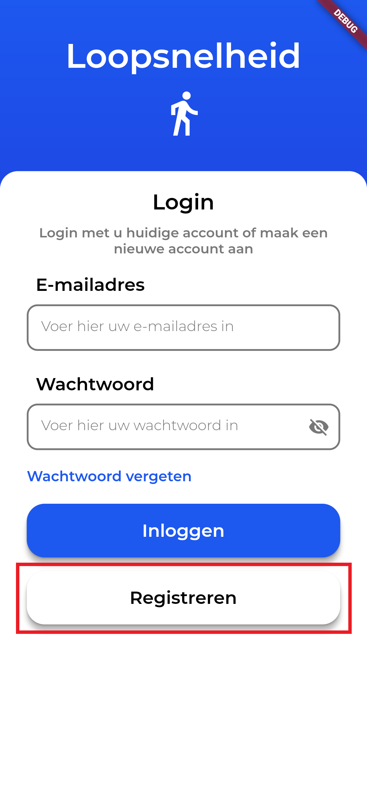

2. Vul uw gegevens in. 

    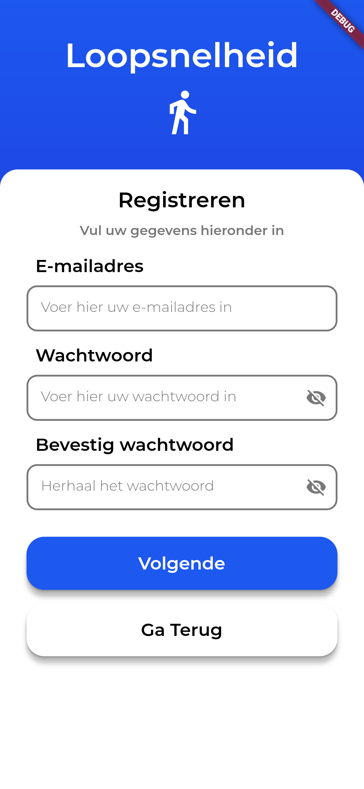

3. Volg de rest van de stappen beschreven in de volgende paginas om een account aan te maken.

### Stap 3: Log-in op uw account

1. Vul uw inlog gegevens in.
2. Klik op de knop `Inloggen`.

    

### Stap 4: Rechten toestaan

1. Bij de melding om "Loopsnelheid toegang te geven tot je fysieke activiteit?", druk op **Toestaan**.

    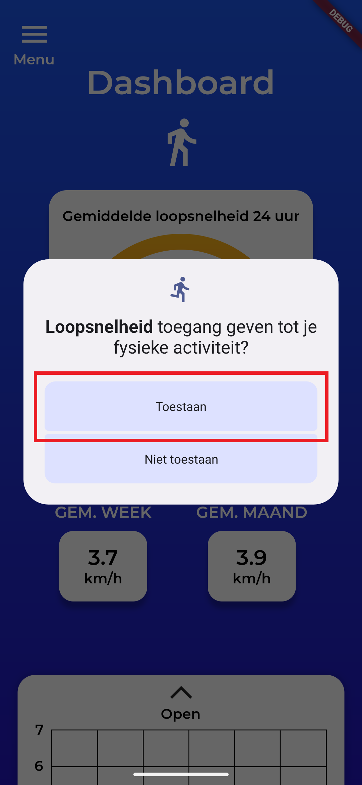

2. Indien u de onderstaande melding krijgt, volg dan de aanwijzingen in de app om Fysieke activiteit rechten toe te staan. Anders kunt u deze stap overslaan en naar volgende stap gaan.

    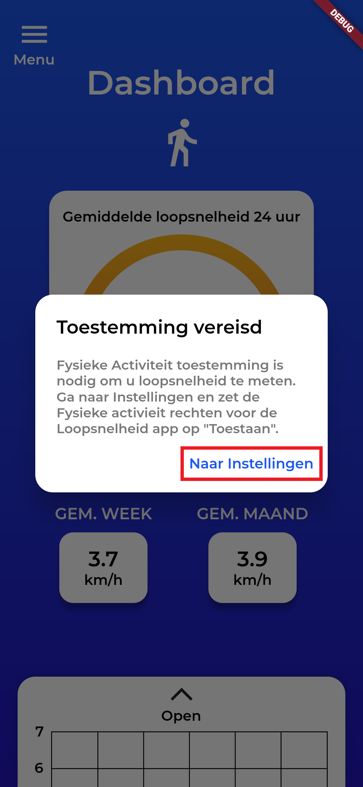
    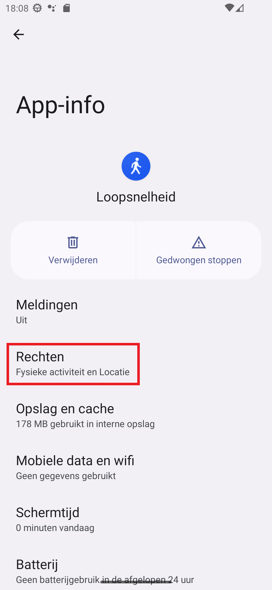
    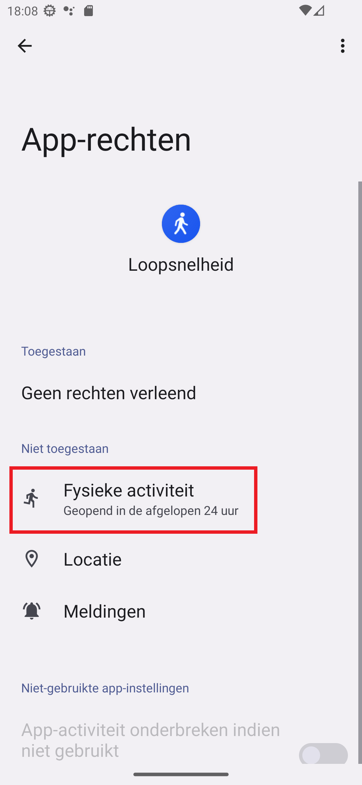
    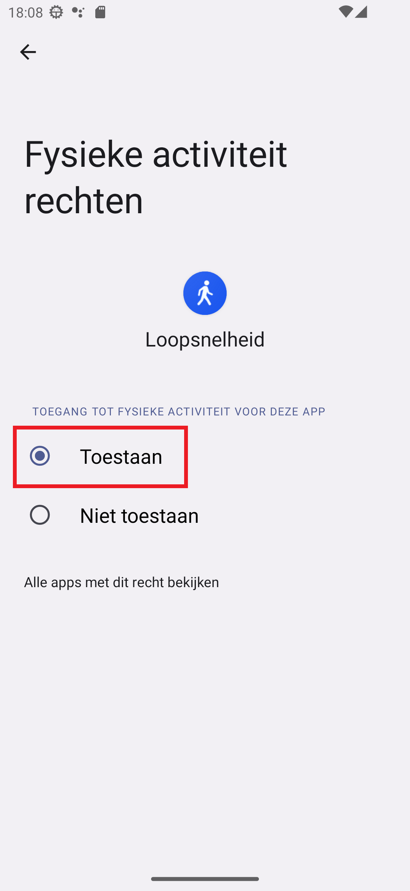

3. Bij de melding om "Loopsnelheid toegang te geven tot de locatie van dit apparaat?", druk op **Altijd toestaan**. Als uw deze optie niet ziet staan druk dan op **Tijdens gebruik van de app**. 

    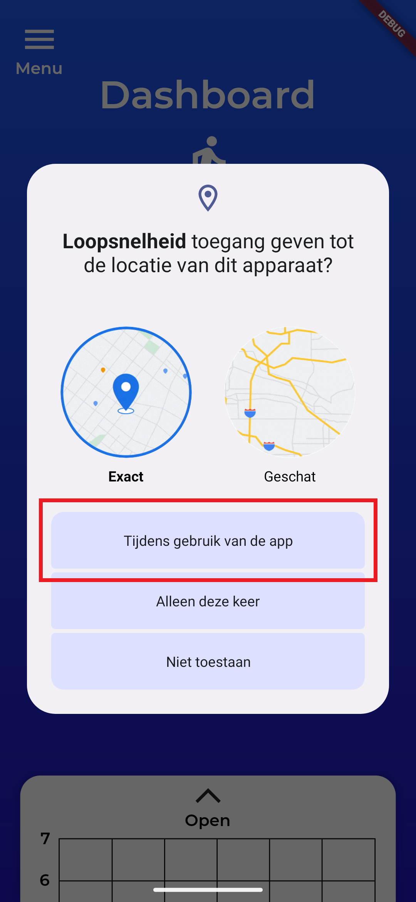

4. Indien u de onderstaande melding krijgt, volg dan de aanwijzingen in de app om Locatie rechten toe te staan. Anders kunt u deze stap overslaan en zijn de rechten van de Loopsnelheid app gereed.

    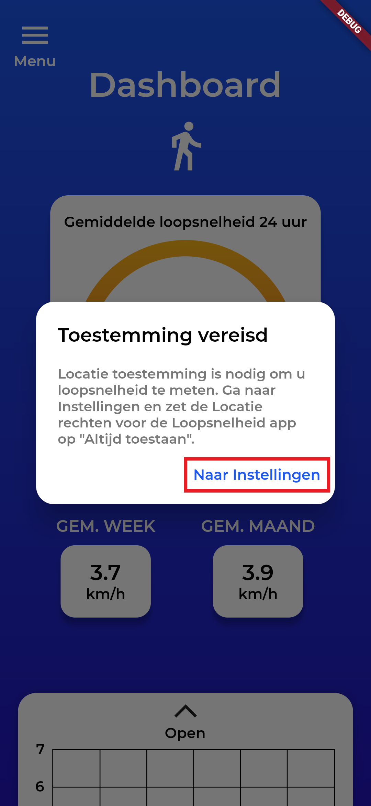
    
    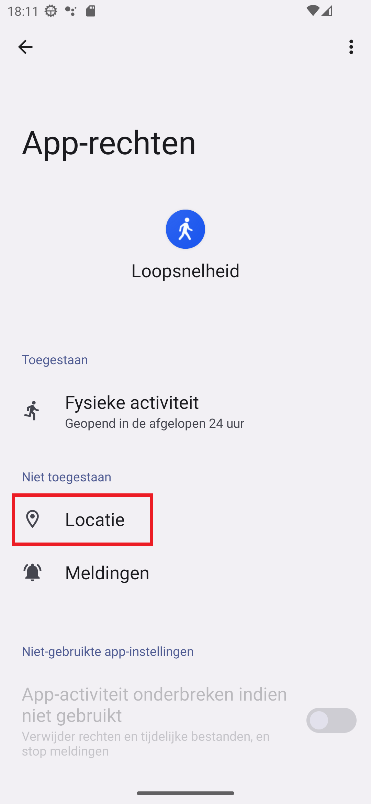
    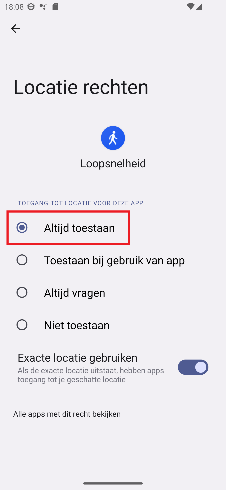

### Stap 5: Meten van uw loopsnelheid

1. Klik op de knop `Menu` om het navigatie menu te openen.

    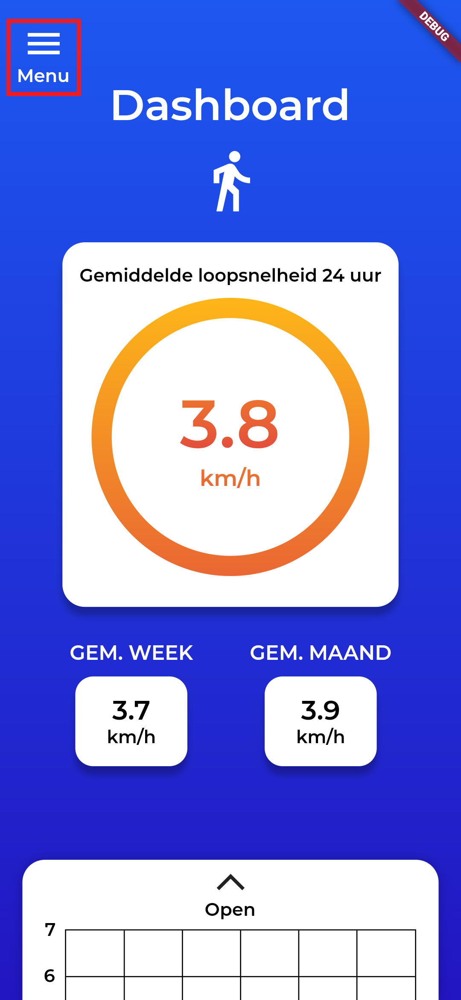

2. Klik op de knop `Instellingen` in het navigatie menu.

    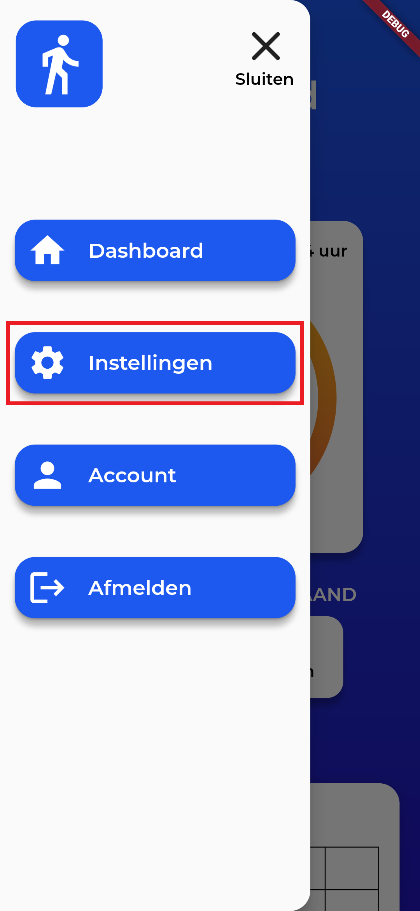

3. Zorg dat de knop `Metingen` **aan** staat zoals de foto hieronder.

    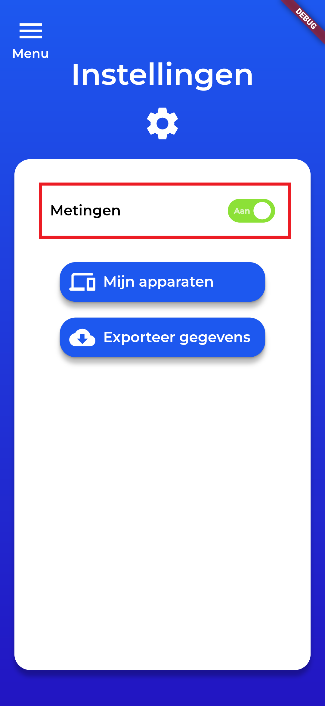

4. Klik op de knop `Mijn apparaten`.

    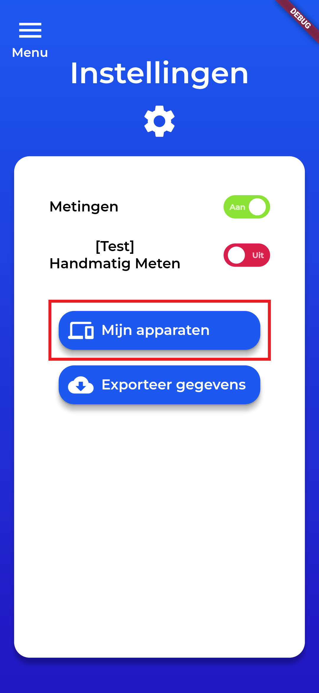

3. Zorg dat uw apparaat aangevinkt is en dat het woord `Meetapparaat` er onder staat.
5. Zorg dat uw apparaat aangevinkt is en dat het woord `Meetapparaat` er onder staat.

    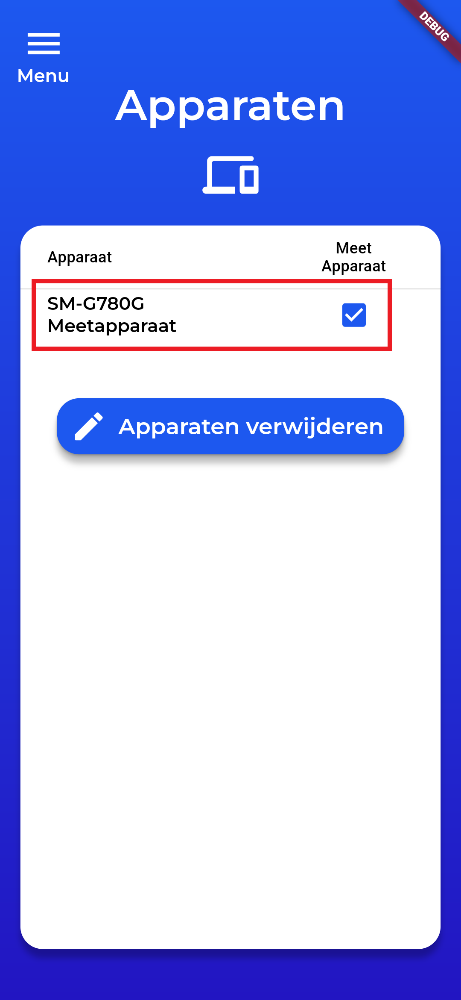

6. Uw apparaat is gereed en de Loopsnelheid app kan worden gebruikt!

### Stap 6: Gebruiken van de app

Na de vorige stappen te hebben gevolgd is u apparaat klaar om uw loopsnelheid te meten. U hoeft dus verder niets te doen. Het is wel belangerijk dat u de applicatie **niet** afsluit maar u kunt uw apparaat verder normaal gebruiken.

De applicatie is zo efficient mogelijk gemaakt en neemt daardoor zo min mogelijk batterij in gebruik.

Om na te gaan of de applicatie werkt kunt u controleren of er in de bovenste balk van uw telefoon (notificatie balk) een klein blaadje staat zoals te zien is op de fotos hieronder.

    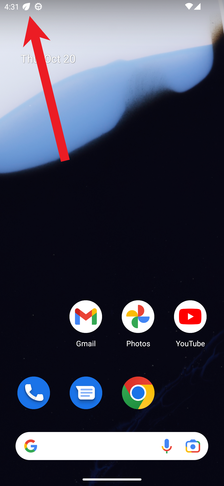
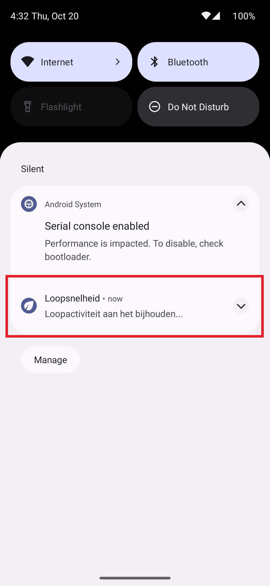

